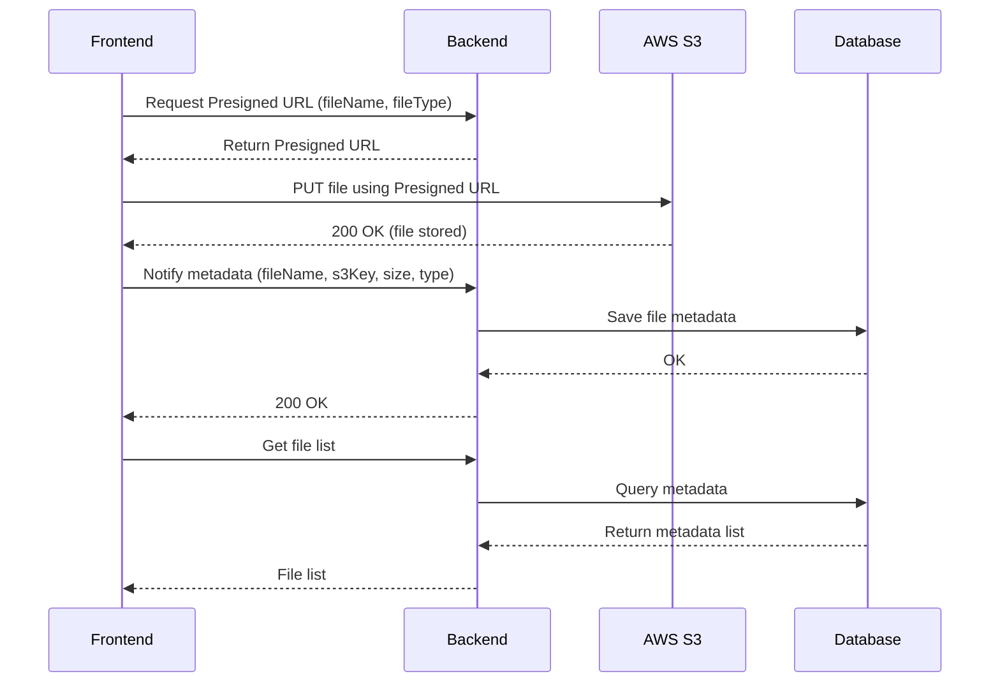

# Hướng dẫn Upload File từ FE lên AWS S3 bằng Presigned URL

## 1. Kiến trúc tổng quan
- **Frontend (FE)**: Xin Presigned URL từ Backend, sau đó upload trực tiếp file lên S3.
- **Backend (BE)**: Sinh Presigned URL, lưu metadata vào DB, đồng bộ dữ liệu.
- **AWS S3**: Lưu trữ file thực tế.
- **Database (DB)**: Lưu thông tin file (key, tên, người upload, v.v.).

---

## 2. Luồng xử lý chi tiết

### Bước 1: FE xin Presigned URL
- FE gọi API:  
  ```
  POST /api/files/presigned-url
  body: { fileName, fileType }
  ```
- BE dùng AWS SDK tạo Presigned URL cho phép `PUT` lên S3, có hạn (`expiresIn`).

### Bước 2: FE upload trực tiếp lên S3
- FE gọi `PUT` lên S3 bằng Presigned URL:
  ```js
  fetch(presignedUrl, {
    method: "PUT",
    headers: { "Content-Type": file.type },
    body: file
  })
  ```
- Nếu thành công → file đã nằm trong bucket.

### Bước 3: FE báo cho BE biết file đã upload
- Gửi API:
  ```
  POST /api/files/metadata
  body: { fileName, s3Key, size, type }
  ```
- BE lưu thông tin vào DB.

### Bước 4: FE hiển thị danh sách file
- FE gọi API:
  ```
  GET /api/files
  ```
- BE trả về danh sách từ DB → FE render (ảnh, PDF, link tải...).

---

## 3. Vấn đề thường gặp

### Trường hợp F5 ngay sau khi upload
- File đã có trên S3 nhưng chưa kịp lưu metadata vào DB.
- Khi FE reload và gọi `GET /api/files`, file mới **chưa có trong DB** → danh sách thiếu.
- Một lúc sau DB cập nhật thì gọi lại mới thấy file.

---

## 4. Giải pháp xử lý

### Cách 1: FE dùng Optimistic UI
- Sau khi upload thành công lên S3, FE **tự thêm file vào danh sách hiển thị (state)**.
- Khi reload, nếu DB chưa có thì vẫn thấy file từ local state.
- Sau khi DB sync xong → gọi API lại để đồng bộ.

### Cách 2: Sử dụng S3 Event Notification
- Cấu hình S3 gửi sự kiện khi có file mới (qua **SQS/SNS/Lambda**).
- BE nhận event → tự động cập nhật DB.
- Đảm bảo DB luôn đồng bộ với S3, không phụ thuộc vào FE báo.

### Cách 3: Kết hợp
- FE vẫn báo BE ngay sau upload (nhanh hơn).
- BE vẫn bật S3 Event để “bắt sót” trong trường hợp FE fail hoặc user F5 sớm.

---

## 5. Best Practice đề xuất
- **Presigned URL cho upload (FE → S3 trực tiếp)** để giảm tải BE.  
- **FE Optimistic UI** để hiển thị ngay file vừa upload.  
- **BE + S3 Event Notification** để đảm bảo DB đồng bộ chính xác.  
- **Presigned URL hoặc CloudFront Signed URL** để hiển thị file từ bucket private.  

---

## 6. Sequence Diagram (Mermaid)



---
